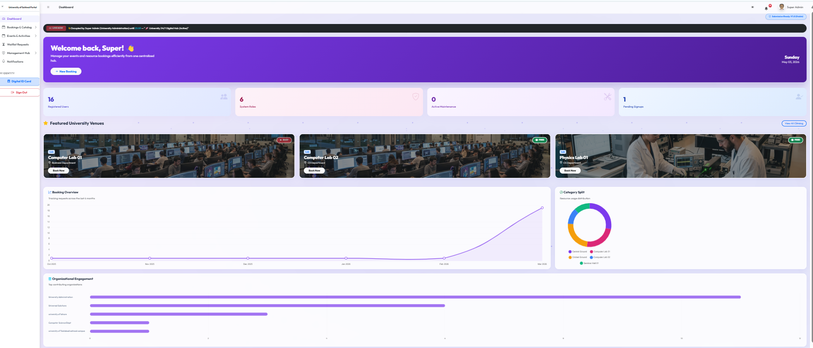
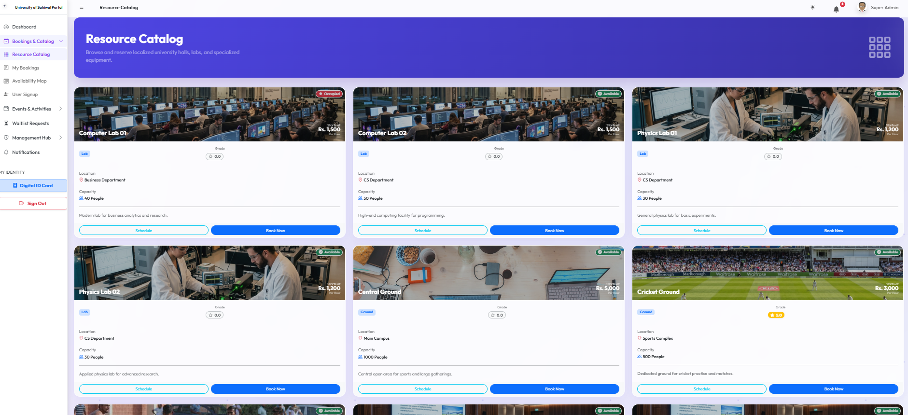
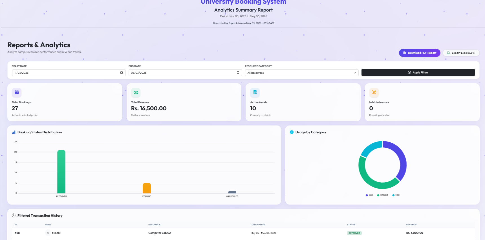
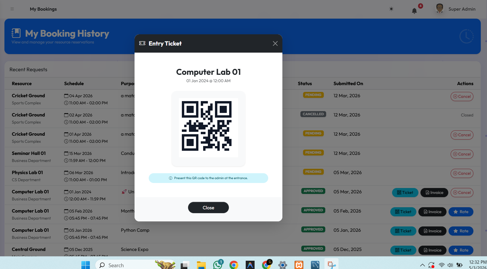

# 🎓 Project Ventixe: Smart Campus Resource & Event Portal
**A Premium, High-End Administrative & Client Solution for Modern Universities**

---

## 🌟 Introduction
**Project Ventixe** is a state-of-the-art facility management and digital identity platform. It is designed to bridge the gap between campus resource allocation and user experience. Whether it's booking a high-tech computer lab, reserving an auditorium for a gala, or managing campus entry via Digital IDs, Ventixe provides a seamless, secure, and professional workflow.

Developed with a focus on **Aesthetics**, **Security**, and **Scalability**, Ventixe is ready for presentation at the final exhibition.

---

## 📖 Quick Navigation
- 📘 [User Operational Manual](docs/user_guide.md) - How to use the system.
- 🛠️ [Technical Implementation Report](docs/technical_report.md) - Architecture & Logic details.
- 🗃️ [Database Schema](sql/project_db.sql) - Latest MySQL dump.

---

## 📸 Screenshots Showcase


*Main Dashboard*


*Resource Catalog*


*Admin Analytics*


*Digital Ticket*

---

## ✨ Key Features
- **🛡️ Advanced RBAC**: Specialized dashboards for Super Admin, Faculty, Students, and External Clients.
- **🔄 Approval-First Payment Workflow**: Secure manual payment verification for premium resources.
- **🆔 Digital Identity Hub**: Automatic generation of Digital ID cards and QR-based entry tickets.
- **📊 Real-time Analytics**: Financial reports, occupancy trends, and interactive charts for administrators.
- **⏳ Smart Waitlist**: Intelligent queue management for fully booked facilities.
- **🖨️ Print-Ready Invoices**: Professional PDF/Media-query optimized invoices for audits.

---

## 🛠️ Tech Stack


---

## 📂 Project Structure
```text
project1/
├── ajax/                # Backend API requests & logic
├── assets/              # Global assets (CSS, JS, Images, Icons)
│   ├── css/             # Custom Ventixe stylesheets
│   ├── js/              # Dynamic UI interactions
│   └── img/             # Project screenshots & branding
├── core/                # Core system files (Auth, DB Config, Helpers)
├── dashboards/          # Role-specific administrative modules
│   ├── student/
│   ├── faculty/
│   └── super_admin/
├── docs/                # User Manuals & Project Documentation
├── includes/            # Reusable UI components (Sidebar, Header, Footer)
├── sql/                 # Database schema & initial data dumps
├── uploads/             # User-uploaded files (Receipts, Profile Pics)
└── index.php            # Main Entry Point
```

---

## 🚀 How to Use
1. **Installation**: Clone the repo and import `project_db.sql` (found in the main folder) into your MySQL database.
2. **Setup**: The `core/config.php` file is already included. Make sure your local MySQL uses `root` and `123456` as the password, or update `config.php` accordingly.
3. **Onboarding**: Register as a Student or Faculty. *Note: Accounts require Admin activation.*
4. **Booking**: Browse the **Resource Catalog**, check availability, and submit a request.
5. **Payment**: For paid resources, upload your receipt screenshot after Admin approval.
6. **Entry**: Download your **QR Ticket** from the "My Bookings" section.

---

## 🔑 Test Credentials (For Instructor Evaluation)
To quickly evaluate the system without registering new accounts, use these active test users:

**Admin Account:**
- **Email:** admin@admin.com
- **Password:** 1234

**Active Student / User Accounts:**
- **Name:** Umair | **Email:** umair@gmail.com | **Password:** 123
- **Name:** Irsha | **Email:** irsha@gmail.com | **Password:** 123
- **Name:** Eman | **Email:** eman@gmail.com | **Password:** 123
- **Name:** Atif | **Email:** atif@gmail.com | **Password:** 123


---

## 🔮 Future Integrations
- [ ] **PHPMailer Integration**: Real-time email notifications for status updates.
- [ ] **Automatic Payment Gateway**: Integration with Stripe/Easypaisa for instant verification.
- [ ] **Interactive Campus Map**: Clickable 2D/3D university layout for venue selection.
- [ ] **Mobile App (PWA)**: Making the portal accessible as a native mobile experience.

---

<div align="center">
  <p><b>Developed with ❤️ for the Final Project Exhibition.</b></p>
  <p><i>Building a smarter campus, one booking at a time.</i></p>
</div>
